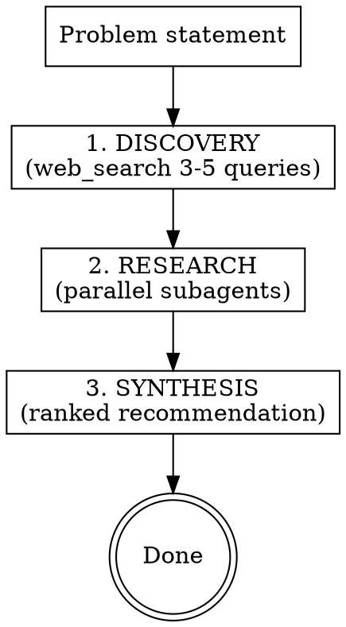

# Best Of

## Overview

Take a problem statement, discover candidate options, research what real
users say via `/reddit-opinions` + `/last30days`, verify GitHub signals
for dev tools, and deliver a single ranked recommendation in the chat.

**Core principle:** Evidence from real users beats feature lists from
marketing pages. A tool with 5k stars and detailed Reddit praise ranks
above one with 50k stars and thin discussion.

## When to Use

- User says "best X", "which X should I use", "alternatives to X"
- User gives a bare category/tool name they want researched
- User wants a recommendation, not a comprehensive catalog

**When NOT to use:**
- User already named the specific tool and wants a deep dive on one
  thing (use `/reddit-opinions` directly)
- User wants ongoing trend tracking (use `/last30days` directly)
- User wants a comparison of two known options (use `/reddit-opinions`
  comparison mode directly)

## Pipeline



### Step 1: Discovery (web_search only)

Run 3-5 web searches to surface candidate options:

- `best {category}` / `best {category} 2026`
- `{category} alternatives`
- `{category} comparison`
- `{category} tools reddit`

Collect 2-6 named candidates. If web search surfaces fewer than 2,
say so and ask the user for candidates rather than fabricating options.

If discovery surfaces more than 5 candidates, list ALL of them before
narrowing. Explicitly name any cut candidates as "also found" with a
one-line reason for exclusion. This lets the user catch omissions
before research begins.

### Step 2: Research (parallel subagents)

Launch in parallel — do NOT run sequentially:

- **`/reddit-opinions`** subagent: pass the candidate list and the
  problem statement. This is the primary evidence source.
- **`/last30days`** subagent: pass the candidate list. Captures
  multi-platform 30-day buzz and trends.
- **GitHub signals** (only if candidates look like software tools):
  for each candidate, web_search or fetch its GitHub repo page. Record:
  star count, open issue count, last commit date, contributor count.
  If a candidate has no GitHub repo, note "no GitHub presence."

**Iron rule:** You MUST use the `/reddit-opinions` and `/last30days`
methodologies. Do NOT substitute generic web search for them. Do NOT
paraphrase README content as "what users say." If you skip either
methodology, the research is invalid.

**How to invoke them:**
- If you can spawn subagents (you are the main session): launch
  `/reddit-opinions` and `/last30days` as parallel subagents via
  `run_subagent`. Pass the candidate list and problem statement.
- If you CANNOT spawn subagents (you are inside a subagent): read each
  skill's SKILL.md and execute its search methodology directly. The
  skills live at `~/.agents/skills/reddit-opinions/SKILL.md` and
  `~/.agents/skills/last30days/SKILL.md`.
- If `/last30days` requires API keys you don't have, execute its
  multi-platform search methodology manually (HN, X, YouTube, blogs)
  rather than skipping it.

### Step 3: Synthesis

Weight evidence in this order:

1. **Reddit first-person evidence** (strongest): detailed comments from
   users who actually used the tool, cross-thread agreement, clear
   tradeoff explanations.
2. **Multi-platform buzz** (strong): corroboration from last30days
   across Reddit, HN, X, YouTube.
3. **GitHub adoption signals** (supporting): stars, maintenance cadence,
   contributor count. These confirm a tool is real and maintained but
   do NOT override user evidence.

## Output Shape

The output IS this structure — match it exactly:

```markdown
**Recommendation: {top pick}** — {one-line why, grounded in user evidence}.

**Candidates found:** {N} options: {comma-separated names with one-line each}.

**Evidence:**
- Reddit: {gist of what Reddit users say, with inline thread links}
- 30-day buzz: {gist from last30days}
- GitHub: {stars / open issues / last commit per candidate, or "n/a"}

**Ranked:**
1. **{option}** — best for {use case}; caveat: {X}. [{evidence pointer}]
2. **{option}** — best for {use case}; caveat: {X}. [{evidence pointer}]
3. **{option}** — best for {use case}; caveat: {X}. [{evidence pointer}]

**Not enough evidence:** {any candidate with thin Reddit + thin buzz}
```

Rules for the output:
- Every opinion claim has an inline citation to a Reddit thread, HN
  post, or GitHub repo. No bare assertions.
- Star counts and issue counts must come from an actual GitHub page
  fetch or search result, not from memory or estimation.
- If a candidate has no Reddit evidence, say so explicitly in the
  "Not enough evidence" section. Do not invent a verdict.
- Maximum 5 candidates in the ranked list. If discovery found more,
  rank the top 5 and list the rest as "also found" with no verdict.
- No emojis.

## Common Mistakes

| Mistake | Fix |
|---------|-----|
| Using generic web_search instead of `/reddit-opinions` | The skill exists for a reason. Invoke it as a subagent, or if nested in a subagent, execute its methodology directly. |
| Paraphrasing README features as "what users say" | README is marketing, not evidence. Only count first-person user comments. |
| Fabricating GitHub star counts | Fetch the actual GitHub repo page. No numbers from memory. |
| Cataloging 9 candidates with full feature lists | Rank top 5 max. User wants a pick, not a catalog. |
| Ranking by star count | Stars are supporting signal. Reddit evidence outranks stars. |
| Skipping "Not enough evidence" for thin candidates | Say it explicitly. Don't invent verdicts for tools nobody discussed. |
| Running research sequentially | Launch reddit-opinions and last30days as parallel subagents. |
